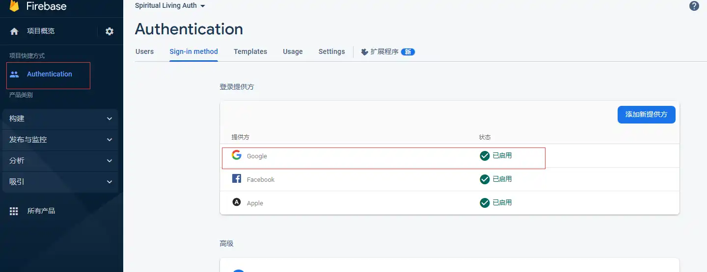

# 基于flutter+PHP+Getx状态管理的第三方登录

谷歌登录、脸书登录、Apple登录

## 谷歌登录

  1. 终端 flutter pub add google_sign_in
  2. 登录到 [firebase控制台](https://firebase.google.com/)添加项目 spiritual-living

### 谷歌登录Android配置

  1. 添加android应用
  2. 获取android SHA1
  3. 进入项目目录
  4. 终端 cd android 运行 ./gradlew signingReport
        
  5. 下载google-services.json,并移动到项目 andoid->app处
          
  6. android->build.gradle添加  classpath 'com.google.gms:google-services:4.3.15' 
  7. android->app->build.gradle添加
      apply plugin: 'com.google.gms.google-services'  
      implementation platform('com.google.firebase:firebase-bom:32.2.0')  
      implementation 'com.google.firebase:firebase-analytics-ktx'
      
  8. 启动google登录 
  9. 唤起google登录

      ```dart
      Future<UserCredential?> signInWithGoogle() async {
        final GoogleSignInAccount? googleSignInAccount =
            await GoogleSignIn().signIn();
        if (googleSignInAccount == null) {
          return null;
        } else {
          final GoogleSignInAuthentication googleAuth =
              await googleSignInAccount.authentication;
          final credential = GoogleAuthProvider.credential(
            accessToken: googleAuth.accessToken,
            idToken: googleAuth.idToken,
          );
          return await FirebaseAuth.instance.signInWithCredential(credential);
        }
      }
      ```

### 谷歌登录IOS配置

1. [添加IOS应用](https://console.firebase.google.com/project/spiritual-living-37328/overview?hl=zh-cn)填入应用ID
2. 下载GoogleService-Info.plist
3. xcode打开项目右键addrunner添加GoogleService-Info.plist到runner  
  
4. 打开info.plist添加(SERVER_CLIENT_ID、REVERSED_CLIENT_ID在GoogleService-Info.plist找到并替换)

   ```xml
   <key>SERVER_CLIENT_ID</key>
   <string>[YOUR SERVER CLIENT ID]</string>
    <key>CFBundleURLTypes</key>
    <array>
        <dict>
        <key>CFBundleTypeRole</key>
        <string>Editor</string>
        <key>CFBundleURLSchemes</key>
        <array>
            <string>[REVERSED_CLIENT_ID ]</string>
        </array>
        </dict>
    </array>
   ```  

### google调用代码

```dart
Future<UserCredential?> signInWithGoogle() async {
  final GoogleSignInAccount? googleSignInAccount =
      await GoogleSignIn().signIn();
  if (googleSignInAccount == null) {
    return null;
  } else {
    final GoogleSignInAuthentication googleAuth =
        await googleSignInAccount.authentication;
    final credential = GoogleAuthProvider.credential(
      accessToken: googleAuth.accessToken,
      idToken: googleAuth.idToken,
    );
    return await FirebaseAuth.instance.signInWithCredential(credential);
  }
}
```

## Apple ID登录

### IOS配置

1. [打开apple开发网并登录](https://idmsa.apple.com/)
2. 创建应用ID 
3. 选择 Sign In with Apple 
4. 在xcode中打开项目,添加Sign In with App服务

### android配置

1. 创建服务ID
2. 创建完成后返回服务列表，打开刚创建的服务ID,勾选Sign In with Apple,并配置Primary App ID
3. 打开firebase应用，启用apple填入相关信息（密码id为key id,p密钥为右边下载的.p8内容）  
4. 复制授权回调网址
5. 填入apple开发网上刚建立的services id的重新定向Return URLs处

### apple调用代码

```dart
Future<UserCredential?> signInWithApple() async {
  final appleProvider = AppleAuthProvider();
  if (kIsWeb) {
    return await FirebaseAuth.instance.signInWithPopup(appleProvider);
  } else {
    return await FirebaseAuth.instance.signInWithProvider(appleProvider);
  }
}
```

## facebook登录

### facebook登录android配置

1. android/app/build.gradle minSdkVersion修改为22

   ```xml
    defaultConfig {
             // TODO: Specify your own unique Application ID (https://developer.android.com/studio/build/application-id.html).
             applicationId "net.pericles.spiritualliving"
             // You can update the following values to match your application needs.
             // For more information, see: https://docs.flutter.dev/deployment/android#reviewing-the-gradle-build-configuration.
             minSdkVersion 21
             targetSdkVersion 34
             versionCode flutterVersionCode.toInteger()
             versionName flutterVersionName
         }
    ```

2. [创建facebook应用](https://developers.facebook.com/apps/)
3. 填入网络、隐私  
  
4. [选择或建立android应用程式](https://developers.facebook.com/docs/facebook-login/android)  
   
5. 项目 > addroid > build.gradle (Module: app)添加  
   implementation 'com.facebook.android:facebook-login:latest.release'

    ```gradle
    dependencies {
     implementation platform('com.google.firebase:firebase-bom:32.2.0')
     implementation 'com.google.firebase:firebase-analytics-ktx'
     implementation "org.jetbrains.kotlin:kotlin-stdlib-jdk7:$kotlin_version"
     implementation 'com.facebook.android:facebook-login:latest.release'
    }
    ``````

6. /android/app/src/main/res/values/新建strings.xml  
    例如，如果您的應用程式編號為 1234，而用戶端憑證為 56789，則程式碼如下所示：

    ```xml
     <?xml version="1.0" encoding="utf-8"?>
     <resources>
         <string name="app_name">Spiritual Living</string>
         <string name="facebook_app_id">1234</string>
         <string name="fb_login_protocol_scheme">fb1234</string>
         <string name="facebook_client_token">6789</string>
     </resources>
    ``````

7. 打开文件/android/app/src/main/AndroidManifest.xml  
   1. 添加网络权限

      ```xml
      <uses-permission android:name="android.permission.INTERNET"/>
      ```

   2. 在 application 元素中，为 Facebook 添加活动，并为 Chrome 自定义选项卡添加活动和意图筛选条件

      ```xml
      <activity android:name="com.facebook.FacebookActivity"
              android:configChanges="keyboard|keyboardHidden|screenLayout|screenSize|orientation"
              android:label="@string/app_name" />
      <activity
          android:name="com.facebook.CustomTabActivity"
          android:exported="true">
          <intent-filter>
              <action android:name="android.intent.action.VIEW" />
              <category android:name="android.intent.category.DEFAULT" />
              <category android:name="android.intent.category.BROWSABLE" />
              <data android:scheme="@string/fb_login_protocol_scheme" />
          </intent-filter>
      </activity>
      ```

   3. 查询 以 Android API 30+ （Android 11+） 为目标平台的应用无法调用 Facebook 原生应用，除非声明了程序包可见性需求

      ```xml
      <queries>
        <package android:name="com.facebook.katana" />
        <provider android:authorities="com.facebook.katana.provider.PlatformProvider" />
      </queries>
      ```

8. 将包名称和默认类与应用关联并保存
9. 生成发布密钥散列
   1. [网址生成](https://emn178.github.io/online-tools/base64_encode.html)：
      1. 终端 cd android 运行 ./gradlew signingReport并复制sha1
      2. key要去除冒号并选择hex生成  
   2. openssl生成：
      1. [下载对应系统版本的openssl](https://code.google.com/archive/p/openssl-for-windows/downloads)
      2. cmd执行 keytool -exportcert -alias sign -keystore "E:\Project\FlutterProject\spiritualliving\android\app\key\sign.jks" | openssl sha1 -binary | openssl base64
10. firebase启动facebook验证  

### facebook登录IOS配置

  1. 打开podfile 修改platform :ios, '12.0'
  2. 使用Facebook注册和配置您的应用程序，添加您的Bundle Identifier
  3. 打开info.plist添加如下(facebook与google例子)

        ```xml
        <key>CFBundleURLTypes</key>
        <array>
          <dict>
            <key>CFBundleTypeRole</key>
            <string>Editor</string>
            <key>CFBundleURLSchemes</key>
            <array>
              <string>fb{your-app-id}</string>
              <string>com.googleusercontent.apps.{your-app-specific-url}</string>
            </array>
          </dict>
        </array>
        <key>FacebookAppID</key>
        <string>{your-app-id}</string>
        <key>FacebookClientToken</key>
        <string>CLIENT-TOKEN</string>
        <key>FacebookDisplayName</key>
        <string>{your-app-name}</string>
        <key>LSApplicationQueriesSchemes</key>
        <array>
          <string>fbapi</string>
          <string>fb-messenger-share-api</string>
        </array>
        ```

### facebook调用代码

 ```dart
 Future<UserCredential?> signInWithFacebook() async {
    final LoginResult loginResult = await FacebookAuth.instance.login();
    if (loginResult.status == LoginStatus.cancelled) {
      showError("用戶取消登錄");
      return null;
    } else if (loginResult.status == LoginStatus.failed) {
      showError("驗證失敗");
      return null;
    } else {
      final OAuthCredential facebookAuthCredential =
          FacebookAuthProvider.credential(loginResult.accessToken!.token);
      return FirebaseAuth.instance.signInWithCredential(facebookAuthCredential);
    }
  }
 ```

## Twitter登录

1. [前往twitter开发网创建应用](https://developer.twitter.com/apps)
2. 对应用设置User authentication settings 
 ***一定要开启用email权限，否则获取不到emial***
3. [firebase](https://console.firebase.google.com/)内Authentication->sign in method 开启twitter,并填写twitter应用key和密钥
4. 复制回调网址，并填写到twitter应用内的Callback URI
5. IOS内打开target->info->URL Schemes，并填写编码的应用 ID,编码的应用 ID在firebase ios应用下可找到

### 调用代码

```dart
Future<UserCredential> signInWithTwitter() async {
  TwitterAuthProvider twitterProvider = TwitterAuthProvider();
  if (kIsWeb) {
    return await FirebaseAuth.instance.signInWithPopup(twitterProvider);
  } else {
    return await FirebaseAuth.instance.signInWithProvider(twitterProvider);
  }
}
```

## 部分完整代码

### dart controller

```dart
import 'dart:convert';
import 'package:firebase_auth/firebase_auth.dart';
import 'package:flutter/foundation.dart';
import 'package:flutter/material.dart';
import 'package:flutter_easyloading/flutter_easyloading.dart';
import 'package:flutter_facebook_auth/flutter_facebook_auth.dart';
import 'package:get/get.dart';
import 'package:google_sign_in/google_sign_in.dart';
import '../common/serivce/api_client.dart';
import '../common/config.dart';
import '../common/utils/easy_toast.dart';
import '../common/utils/ios_dialog.dart';
import '../common/utils/storage_manage.dart';
import '../routes/app_pages.dart';

class SignInController extends GetxController
    with GetSingleTickerProviderStateMixin {
  StorageManage storageManage = StorageManage();
  GlobalKey<FormState> formkey = GlobalKey<FormState>();
  final TextEditingController nameCtl = TextEditingController();
  final TextEditingController pwdCtl = TextEditingController();
  RxBool isShowPassword = true.obs;
  late AnimationController animationController;

  @override
  void onInit() {
    animationController =
        AnimationController(vsync: this, duration: const Duration(seconds: 2))
          ..repeat(reverse: true);
    var loginInfo = storageManage.read(Config.loginInfo);
    if (loginInfo != null) {
      Map loginInfoMap = jsonDecode(loginInfo);
      if (loginInfoMap['loginType'] == "normal") {
        nameCtl.text = loginInfoMap['user_name'] ?? "";
        pwdCtl.text = loginInfoMap['user_password'] ?? "";
      }
    }
    isShowPassword.value = true;

    super.onInit();
  }

  @override
  void onClose() {
    animationController.dispose();
    super.onClose();
  }

  ///判断登录信息是否存在，且在登录状态时直接进入webview

  void checkLogin() {
    var loginInfo = storageManage.read(Config.loginInfo);
    if (loginInfo != null) {
      Map loginInfoMap = jsonDecode(loginInfo);
      if (loginInfoMap["islogin"]) {
        Get.offAndToNamed(Routes.webpage);
      }
    }
  }

  ///普通登錄
  Future<void> normalLogin() async {
    Map<String, dynamic>? loginData;
    String name = nameCtl.text;
    String pwd = pwdCtl.text;
    loginData = {
      "displayName": name,
      "pwd": pwd,
      "loginType": "normal",
    };

    //执行远程登录
    remoteLogin(
      data: loginData,
      loginType: 'normal',
    );
  }

  /// 第三方登录
  /// loginType 登录类型

  Future<void> handleSignIn({required String loginType}) async {
    Map<String, dynamic>? loginData;

    try {
      if (loginType == "google") {
        UserCredential? auth = await signInWithGoogle();
        if (auth != null) {
          User? user = auth.user;
          if (user != null) {
            googleWithSignOut();
            String? displayName = user.displayName!
                .replaceAll(RegExp(r'\s+'), " ")
                .replaceAll(" ", "-");
            String? email = user.email;
            loginData = {
              "displayName": displayName,
              "email": email,
              "loginType": loginType,
            };
          }
        }
      } else if (loginType == "facebook") {
        UserCredential? auth = await signInWithFacebook();
        if (auth != null) {
          User? user = auth.user;
          if (user != null) {
            facebookWithSignOut();
            String? displayName = user.displayName!
                .replaceAll(RegExp(r'\s+'), " ")
                .replaceAll(" ", "-");
            String? email = user.email;
            loginData = {
              "displayName": displayName,
              "email": email,
              "loginType": loginType,
            };
          }
        }
      } else if (loginType == "apple") {
        UserCredential? auth = await signInWithApple();

        if (auth != null) {
          User? user = auth.user;
          if (user != null) {
            String? displayName = user.displayName;
            String? email = user.email;
            loginData = {
              "displayName": displayName,
              "email": email,
              "loginType": loginType,
            };
          }
        }
      } else if (loginType == "twitter") {
        UserCredential? auth = await signInWithTwitter();

        User? user = auth.user;
        if (user != null) {
          String? displayName = user.displayName;
          String? email = user.email;
          loginData = {
            "displayName": displayName,
            "email": email,
            "loginType": loginType,
          };
        }
      } else if (loginType == "normal") {
        String name = nameCtl.text;
        String pwd = pwdCtl.text;
        loginData = {
          "displayName": name,
          "pwd": pwd,
          "loginType": loginType,
        };
      }
      if (loginData != null) {
        //执行远程登录
        remoteLogin(
          data: loginData,
          loginType: loginType,
        );
      }
    } catch (e) {
      if (loginType == "google") {
        googleWithSignOut();
      }
      if (loginType == "facebook") {
        googleWithSignOut();
      }
      showError("登錄失敗");
    }
  }

  ///远程登录，获取登录信息
  void remoteLogin(
      {required Map<String, dynamic> data, required String loginType}) async {
    if (loginType == "normal") {
      showloading("登錄中");
    } else {
      showloading("授權成功,登錄中");
    }

    ApiClient apiClient = ApiClient();
    var ret = await apiClient.post(path: Config.loginUrl, data: data);
    if (EasyLoading.isShow) {
      EasyLoading.dismiss();
    }
    if (ret != null) {
      Map<String, dynamic> remoteLoginRet = jsonDecode(ret);
      if (remoteLoginRet["code"] == 200) {
        saveRemoteInfo(remoteData: remoteLoginRet, loginType: loginType);

        Get.offAndToNamed(Routes.webpage);
      } else if (remoteLoginRet["code"] == 202) {
        //只有普通註冊時，賬號不存在才返回202
        iosDialog(
            context: Get.context!,
            content: "賬號不存在，是否繼續註冊",
            confirm: () {
              Get.back(); //關閉對話框
              showloading("註冊中"); //彈出對話框
              if (!data.containsKey("isContinue")) {
                data.putIfAbsent("isContinue", () => true); //添加繼續註冊標識，後台識別
              }
              remoteLogin(data: data, loginType: "normal"); //再次調用遠程登錄
            });
      } else {
        if (loginType == "google") {
          googleWithSignOut();
        }
        showError("登錄失敗");
      }
    } else {
      if (loginType == "google") {
        googleWithSignOut();
      }
      if (loginType == "facebook") {
        googleWithSignOut();
      }
      showError("登錄失敗");
    }
  }

  ///保存远程信息
  void saveRemoteInfo({required Map remoteData, required String loginType}) {
    //print(remoteData);
    final String cookieName = "wordpress_logged_in_${remoteData["cookieHash"]}";
    final String cookieValue = remoteData["cookieValue"];
    final int userID = remoteData["userID"];
    var loginInfo = {
      "loginType": loginType,
      "cookieName": cookieName,
      "cookieValue": cookieValue,
      "userID": userID,
      "islogin": true,
    };
    if (loginType == "normal") {
      //如果是普通登录，存入用户名与密码
      loginInfo.putIfAbsent("user_name", () => nameCtl.text);
      loginInfo.putIfAbsent("user_password", () => pwdCtl.text);
    }
    storageManage.delete(Config.loginInfo);
    storageManage.save(Config.loginInfo, jsonEncode(loginInfo));
  }

  ///google登录，并将信息存储在firebase
  Future<UserCredential?> signInWithGoogle() async {
    final GoogleSignInAccount? googleSignInAccount =
        await GoogleSignIn().signIn();
    if (googleSignInAccount == null) {
      return null;
    } else {
      final GoogleSignInAuthentication googleAuth =
          await googleSignInAccount.authentication;
      final credential = GoogleAuthProvider.credential(
        accessToken: googleAuth.accessToken,
        idToken: googleAuth.idToken,
      );
      return await FirebaseAuth.instance.signInWithCredential(credential);
    }
  }

  /// facebook登錄
  Future<UserCredential?> signInWithFacebook() async {
    final LoginResult loginResult = await FacebookAuth.instance.login();
    //print("===========>${loginResult.status}");
    if (loginResult.status == LoginStatus.cancelled) {
      showError("用戶取消登錄");
      return null;
    } else if (loginResult.status == LoginStatus.failed) {
      showError("驗證失敗");
      return null;
    } else {
      final OAuthCredential facebookAuthCredential =
          FacebookAuthProvider.credential(loginResult.accessToken!.token);
      return FirebaseAuth.instance.signInWithCredential(facebookAuthCredential);
    }
  }

  ///推特登录
  Future<UserCredential> signInWithTwitter() async {
    TwitterAuthProvider twitterProvider = TwitterAuthProvider();
    if (kIsWeb) {
      return await FirebaseAuth.instance.signInWithPopup(twitterProvider);
    } else {
      return await FirebaseAuth.instance.signInWithProvider(twitterProvider);
    }
  }

  /// apple登錄
  Future<UserCredential?> signInWithApple() async {
    final appleProvider = AppleAuthProvider();
    if (kIsWeb) {
      return await FirebaseAuth.instance.signInWithPopup(appleProvider);
    } else {
      return await FirebaseAuth.instance.signInWithProvider(appleProvider);
    }
  }

  ///退出google登录
  Future<GoogleSignInAccount?> googleWithSignOut() async {
    try {
      final GoogleSignIn googleSignIn = GoogleSignIn();
      return await googleSignIn.signOut();
    } catch (e) {
      return null;
    }
  }

  ///退出facebook
  Future<void> facebookWithSignOut() async {
    try {
      final FacebookAuth facebookAuth = FacebookAuth.instance;
      return await facebookAuth.logOut();
    } catch (e) {
      return;
    }
  }
}
```

### dart UI

```dart
import 'package:flutter/material.dart';
import 'package:flutter_staggered_animations/flutter_staggered_animations.dart';
import 'package:get/get.dart';

import '../common/config.dart';
import '../common/style/style.dart';
import '../common/utils/form_help.dart';
import '../controller/sign_in_controller.dart';

class SignIn extends StatelessWidget {
  SignIn({super.key});
  final signInCtl = Get.find<SignInController>();
  @override
  Widget build(BuildContext context) {
    // WidgetsBinding.instance.addPostFrameCallback((timeStamp) {
    //   signInCtl.checkLogin();
    // });
    final paddingTop = MediaQuery.of(context).padding.top;
    return Scaffold(
      resizeToAvoidBottomInset: true,
      body: Container(
        padding: EdgeInsets.only(
          top: paddingTop,
          left: Get.width * 0.08,
          right: Get.width * 0.08,
        ),
        decoration: boxLinear,
        width: double.infinity,
        height: double.infinity,
        child: Form(
          key: signInCtl.formkey,
          child: SingleChildScrollView(
            child: Column(
              children: [
                SlideTransition(
                  position: Tween(begin: Offset.zero, end: const Offset(0, .1))
                      .chain(CurveTween(curve: Curves.linear))
                      .animate(signInCtl.animationController),
                  child: Container(
                      constraints: const BoxConstraints(maxHeight: 200.0),
                      child: Image.asset("assets/splash.png")),
                ),
                const SizedBox(
                  height: 20,
                ),
                AnimationLimiter(
                  child: Column(
                    children: AnimationConfiguration.toStaggeredList(
                      duration: const Duration(milliseconds: 375),
                      childAnimationBuilder: (widget) => SlideAnimation(
                        horizontalOffset: MediaQuery.of(context).size.width / 2,
                        child: FadeInAnimation(child: widget),
                      ),
                      children: [
                        ///用戶名或郵箱
                        FormHelper.textInput(
                          controller: signInCtl.nameCtl,
                          labelText: "用戶名或郵箱",
                          icon: Icons.person,
                          keyboardType: TextInputType.visiblePassword,
                          validator: (value) {
                            if (value!.isEmpty) {
                              return "用戶名或郵箱不能為空";
                            }
                            return null;
                          },
                        ),
                        SizedBox(height: Config.space),

                        ///密码
                        Obx(() => FormHelper.textInput(
                            controller: signInCtl.pwdCtl,
                            icon: Icons.lock_outline,
                            labelText: "密碼",
                            keyboardType: TextInputType.visiblePassword,
                            validator: (value) {
                              if (value!.isEmpty) {
                                return '密碼不能為空';
                              }
                              return null;
                            },
                            obscureText: signInCtl.isShowPassword.value,
                            suffixIcon: Padding(
                              padding: const EdgeInsets.only(right: 8.0),
                              child: IconButton(
                                color: Colors.white70,
                                icon: signInCtl.isShowPassword.value
                                    ? const Icon(Icons.visibility)
                                    : const Icon(Icons.visibility_off),
                                onPressed: () {
                                  signInCtl.isShowPassword.value =
                                      !signInCtl.isShowPassword.value;
                                },
                              ),
                            ))),

                        SizedBox(height: Config.space),

                        ///普通登录
                        FormHelper.submitUIButton(
                          context,
                          title: "賬號密碼登錄",
                          icon: const Icon(Icons.email),
                          textColor: Colors.black87,
                          //color: Colors.grey[600],
                          onTap: () {
                            FocusScope.of(context).unfocus();
                            var currentState = signInCtl.formkey.currentState;
                            if (currentState!.validate()) {
                              signInCtl.handleSignIn(loginType: "normal");
                            }
                          },
                        ),

                        ///谷歌登录
                        FormHelper.submitUIButton(
                          context,
                          title: "Google登錄",
                          icon: ColorFiltered(
                            colorFilter: const ColorFilter.mode(
                                Colors.white, BlendMode.modulate),
                            child: ClipRRect(
                              borderRadius: BorderRadius.circular(28),
                              clipBehavior: Clip.antiAlias,
                              child: const Image(
                                image: AssetImage("assets/google.png"),
                                height: 30.0,
                                width: 30.0,
                              ),
                            ),
                          ),
                          color: const Color.fromARGB(66, 18, 7, 170),
                          onTap: () async {
                            signInCtl.handleSignIn(loginType: "google");
                          },
                        ),

                        ///脸书登录
                        FormHelper.submitUIButton(
                          context,
                          title: "Facebook登錄",
                          icon: ColorFiltered(
                            colorFilter: const ColorFilter.mode(
                                Colors.white, BlendMode.srcIn),
                            child: ClipRRect(
                              borderRadius: BorderRadius.circular(28),
                              clipBehavior: Clip.antiAlias,
                              child: const Image(
                                image: AssetImage("assets/facebook.png"),
                                height: 30.0,
                                width: 30.0,
                              ),
                            ),
                          ),
                          color: const Color.fromARGB(255, 52, 6, 138),
                          onTap: () async {
                            signInCtl.handleSignIn(loginType: "facebook");
                          },
                        ),

                        ///IOS Apple ID登录

                        FormHelper.submitUIButton(
                          context,
                          title: "Apple登錄",
                          icon: ColorFiltered(
                            colorFilter: const ColorFilter.mode(
                                Colors.white, BlendMode.srcIn),
                            child: ClipRRect(
                              borderRadius: BorderRadius.circular(28),
                              clipBehavior: Clip.hardEdge,
                              child: const Image(
                                image: AssetImage("assets/apple.png"),
                                height: 30.0,
                                width: 30.0,
                              ),
                            ),
                          ),
                          color: Colors.black87,
                          onTap: () async {
                            signInCtl.handleSignIn(loginType: "apple");
                          },
                        ),

                        FormHelper.submitUIButton(
                          context,
                          title: "Twitter登錄",
                          icon: ColorFiltered(
                            colorFilter: const ColorFilter.mode(
                                Colors.white, BlendMode.srcIn),
                            child: ClipRRect(
                              borderRadius: BorderRadius.circular(28),
                              clipBehavior: Clip.hardEdge,
                              child: const Image(
                                image: AssetImage("assets/twitter.png"),
                                height: 30.0,
                                width: 30.0,
                              ),
                            ),
                          ),
                          color: const Color(0xFF00aced),
                          onTap: () async {
                            signInCtl.handleSignIn(loginType: "twitter");
                          },
                        ),
                      ],
                    ),
                  ),
                ),
              ],
            ),
          ),
        ),
      ),
    );
  }
}
```

### php代码

```php
<?php

error_reporting(0);
//引入WP加载文件
require "../wp-load.php";
header("Content-type:text/html;charset=utf-8");
//允许跨域
header('Access-Control-Allow-Origin:*');
header('Access-Control-Allow-Methods:POST,GET,OPTIONS,DELETE');
header('Access-Control-Allow-Credentials: true');
header('Access-Control-Allow-Headers: Content-Type,Content-Length,Accept-Encoding,X-Requested-with, Origin');
global $wpdb;
// 检测isActive 在user表中是否存在
$users_fields = $wpdb->get_results("SHOW FIELDS FROM wp_users;");
$field_column = array_column($users_fields, "Field");
if (!in_array("isActive", $field_column)) {
    $wpdb->query("ALTER table wp_users add column isActive tinyint default 1 COMMENT '1:enable,0:disable';");
}

$postDate = $_POST;
$displayName = $postDate["displayName"] ?? "";
$email = $postDate["email"] ?? "";
$pwd = $postDate["pwd"] ?? "";
$loginType = $postDate["loginType"] ?? "";
$isContinue = $postDate["isContinue"] ?? false;
$pass = wp_generate_password();
$user_ID = $postDate["userID"] ?? 0;
if ($loginType == "delAccount") {
    $wpdb->query("UPDATE  wp_users set isActive = 0 where ID = $user_ID");
} else if ($loginType == "normal") {
    $login_data["user_login"] = $displayName;
    $login_data["user_password"] = $pwd;
    $user_verify = wp_signon($login_data, false);

    if (is_wp_error($user_verify)) {//數據庫不存在用戶數據時
        if ($isContinue) {//前端彈出對話框,用戶選擇繼續註冊
            if (filter_var($displayName, FILTER_VALIDATE_EMAIL)) {
                $email = $displayName;
            }
            $signUpData = [
                'user_login'    => $displayName,
                'user_pass'     => $pwd,
                'user_nicename' => sanitize_user($displayName, true),
                'display_name'  => $displayName,
                'nickname'      => $displayName,
                'first_name'    => $displayName,
                'user_email'    => $email,
                'role'          => get_option('default_role')
            ];
            $userID = wp_insert_user($signUpData);
            if (!is_wp_error($userID)) {
                echo loginData($userID);
            } else {
                $login_data['code'] = 201;
                $login_data['msg'] = '注册并登录失败';
                echo json_encode($login_data);
            }
        } else {
            $login_data['code'] = 202;
            $login_data['msg'] = '用户不存在,是否注册';
            echo json_encode($login_data);
            die();
        }
    } else {//數據庫存在用戶數據時
        $isActive = $user_verify->data->isActive;//用戶是否已注銷1使用中，0注銷狀態
        $userID = $user_verify->ID;
        if ($isActive == 0) {
            if (!$isContinue) {
                $login_data['code'] = 202;
                $login_data['msg'] = '用户不存在,是否注册';
                echo json_encode($login_data);
                die();
            } else {
                $wpdb->query("UPDATE  wp_users set isActive = 1 where ID = $userID");
                echo loginData($userID);
                die;
            }
        } else {
            echo loginData($userID);
            die;
        }
    }

} else {
    //检查是否是apple以隐藏电子的形式登录
    $obj = null;
    if (stripos($email, "privaterelay.appleid.com") !== false) {
        $obj = get_user_by("login", $displayName);
    } else {
        $obj = get_user_by("email", $email);
    }
    $userID = 0;
    if ($obj) {
        $userID = $obj->ID;
    }
    if ($userID != 0) {//用户存在时
        //当登录是用第三方一键登录时
        if ($loginType != "normal") {
            echo loginData($userID, $email);
        }
    } else {//用户不存在时
        $signUpData = array(
            'user_login'    => $displayName,
            'user_pass'     => wp_generate_password(),
            'user_nicename' => sanitize_user($displayName, true),
            'display_name'  => $displayName,
            'nickname'      => $displayName,
            'first_name'    => $displayName,
            'user_email'    => $email,
            'role'          => get_option('default_role')
        );
        $userID = wp_insert_user($signUpData);
        if (!is_wp_error($userID)) {
            echo loginData($userID);
        } else {
            $login_data['code'] = 201;
            $login_data['msg'] = '注册并登录失败';
            echo json_encode($login_data);
        }
    }
}


/**
 * @param int $userID
 * @return string
 */
function loginData(int $userID, string $email = ""): string {   //设置登录过期时间

    if ($email != "") {//更新email
        wp_update_user(["ID" => $userID, "user_email" => $email]);
    }
    $expiration = time() + apply_filters('auth_cookie_expiration', 50 * 365 * DAY_IN_SECONDS, $userID, true);
    //生成登录cookie值
    $cookieValue = wp_generate_auth_cookie($userID, $expiration, 'logged_in');
    $login_data['code'] = 200;
    $login_data['msg'] = '登录成功';
    $login_data["cookieHash"] = COOKIEHASH;
    $login_data["cookieValue"] = $cookieValue;
    $login_data["userID"] = $userID;
    return json_encode($login_data);
}


//允许中文名注册
//function allowed_chinese_name($username, $raw_username, $strict)
//{
//    $username = wp_strip_all_tags($raw_username);
//    $username = remove_accents($username);
//    $username = preg_replace('|%([a-fA-F0-9][a-fA-F0-9])|', '', $username);
//    $username = preg_replace('/&.+?;/', '', $username);
//    if ($strict) {
//        $username = preg_replace('|[^a-z\p{Han}0-9 _.\-@]|iu', '', $username);
//    }
//    $username = trim($username);
//    $username = preg_replace('|\s+|', ' ', $username);
//    return $username;
//}
//
//add_filter('sanitize_user', 'allowed_chinese_name', 10, 3);
```
