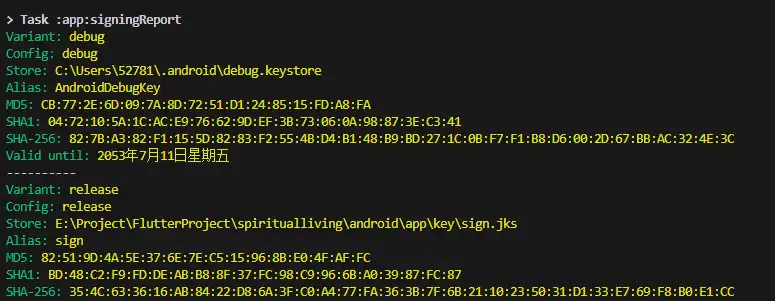
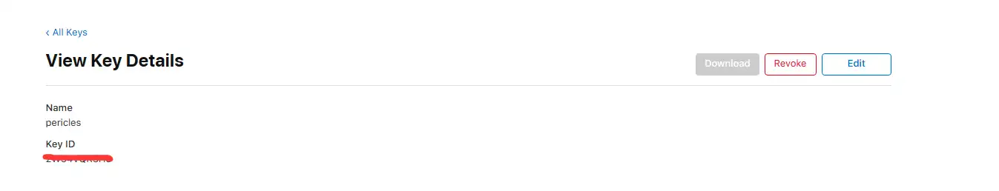

# 基于flutter+PHP+Getx状态管理的第三方登录

谷歌登录、脸书登录、Apple登录

## 谷歌登录
  1. 终端 flutter pub add google_sign_in
  2. 登录到 [firebase控制台](https://firebase.google.com/)添加项目 spiritual-living
#### 谷歌登录Android配置
  1. 添加android应用
  2. 获取android SHA1
  3. 进入项目目录
  4. 终端 cd android 运行 ./gradlew signingReport
        
  5. 下载google-services.json,并移动到项目 andoid->app处
          
  6. android->build.gradle添加  classpath 'com.google.gms:google-services:4.3.15' 
  7. android->app->build.gradle添加   
      apply plugin: 'com.google.gms.google-services'  
      implementation platform('com.google.firebase:firebase-bom:32.2.0')  
      implementation 'com.google.firebase:firebase-analytics-ktx'
      
  8.  启动google登录 
  9.  唤起google登录
      ```dart
      Future<UserCredential?> signInWithGoogle() async {
        final GoogleSignInAccount? googleSignInAccount =
            await GoogleSignIn().signIn();
        if (googleSignInAccount == null) {
          return null;
        } else {
          final GoogleSignInAuthentication googleAuth =
              await googleSignInAccount.authentication;
          final credential = GoogleAuthProvider.credential(
            accessToken: googleAuth.accessToken,
            idToken: googleAuth.idToken,
          );
          return await FirebaseAuth.instance.signInWithCredential(credential);
        }
      }
      ``````
        
    


#### 谷歌登录IOS配置
1. [添加IOS应用](https://console.firebase.google.com/project/spiritual-living-37328/overview?hl=zh-cn)填入应用ID
2. 下载GoogleService-Info.plist
3. xcode打开项目右键addrunner添加GoogleService-Info.plist到runner  
  
4. 打开info.plist添加(SERVER_CLIENT_ID、REVERSED_CLIENT_ID在GoogleService-Info.plist找到并替换)
   ```xml
   <key>SERVER_CLIENT_ID</key>
   <string>[YOUR SERVER CLIENT ID]</string>
    <key>CFBundleURLTypes</key>
    <array>
    	<dict>
    		<key>CFBundleTypeRole</key>
    		<string>Editor</string>
    		<key>CFBundleURLSchemes</key>
    		<array>
    			<string>[REVERSED_CLIENT_ID ]</string>
    		</array>
    	</dict>
    </array>
   ```  

## Apple ID登录
#### IOS配置
1. [打开apple开发网并登录](https://idmsa.apple.com/)
2. 创建应用ID 
3. 选择 Sign In with Apple 
4. 在xcode中打开项目,添加Sign In with App服务
#### android配置
1. 创建服务ID
2. 创建完成后返回服务列表，打开刚创建的服务ID,勾选Sign In with Apple,并配置Primary App ID
3. 打开firebase应用，启用apple填入相关信息（密码id为key id,p密钥为右边下载的.p8内容）  
4. 复制授权回调网址
5. 填入apple开发网上刚建立的services id的重新定向Return URLs处

#### 调用代码
```dart
Future<UserCredential?> signInWithApple() async {
  final appleProvider = AppleAuthProvider();
  if (kIsWeb) {
    return await FirebaseAuth.instance.signInWithPopup(appleProvider);
  } else {
    return await FirebaseAuth.instance.signInWithProvider(appleProvider);
  }
}
```

## facebook登录
#### facebook登录android配置
1. android/app/build.gradle minSdkVersion修改为22
   ```xml
    defaultConfig {
             // TODO: Specify your own unique Application ID (https://developer.android.com/studio/build/application-id.html).
             applicationId "net.pericles.spiritualliving"
             // You can update the following values to match your application needs.
             // For more information, see: https://docs.flutter.dev/deployment/android#reviewing-the-gradle-build-configuration.
             minSdkVersion 21
             targetSdkVersion 34
             versionCode flutterVersionCode.toInteger()
             versionName flutterVersionName
         }
    ``` 
2. [创建facebook应用](https://developers.facebook.com/apps/) 
3. 填入网络、隐私  
  
4. [选择或建立android应用程式](https://developers.facebook.com/docs/facebook-login/android)  
   
5. 项目 > addroid > build.gradle (Module: app)添加  
   implementation 'com.facebook.android:facebook-login:latest.release'
    ```gradle
    dependencies {
     implementation platform('com.google.firebase:firebase-bom:32.2.0')
     implementation 'com.google.firebase:firebase-analytics-ktx'
     implementation "org.jetbrains.kotlin:kotlin-stdlib-jdk7:$kotlin_version"
     implementation 'com.facebook.android:facebook-login:latest.release'
    }
    ``````
6. /android/app/src/main/res/values/新建strings.xml  
    例如，如果您的應用程式編號為 1234，而用戶端憑證為 56789，則程式碼如下所示：
    ```xml
     <?xml version="1.0" encoding="utf-8"?>
     <resources>
         <string name="app_name">Spiritual Living</string>
         <string name="facebook_app_id">1234</string>
         <string name="fb_login_protocol_scheme">fb1234</string>
         <string name="facebook_client_token">6789</string>
     </resources>
    ``````
7. 打开文件/android/app/src/main/AndroidManifest.xml  
  1. 添加网络权限
      ```xml
      <uses-permission android:name="android.permission.INTERNET"/>
      ``` 
  2. 在 application 元素中，为 Facebook 添加活动，并为 Chrome 自定义选项卡添加活动和意图筛选条件  
      ```xml
      <activity android:name="com.facebook.FacebookActivity"
              android:configChanges="keyboard|keyboardHidden|screenLayout|screenSize|orientation"
              android:label="@string/app_name" />
      <activity
          android:name="com.facebook.CustomTabActivity"
          android:exported="true">
          <intent-filter>
              <action android:name="android.intent.action.VIEW" />
              <category android:name="android.intent.category.DEFAULT" />
              <category android:name="android.intent.category.BROWSABLE" />
              <data android:scheme="@string/fb_login_protocol_scheme" />
          </intent-filter>
      </activity>
      ```   
  3. 查询 以 Android API 30+ （Android 11+） 为目标平台的应用无法调用 Facebook 原生应用，除非声明了程序包可见性需求
      ```xml
      <queries>
        <package android:name="com.facebook.katana" />
        <provider android:authorities="com.facebook.katana.provider.PlatformProvider" />
      </queries>
      ```
 
   
 8. 将包名称和默认类与应用关联并保存
 9.  生成发布密钥散列  
      1.  [网址生成](https://emn178.github.io/online-tools/base64_encode.html)：
          1.  终端 cd android 运行 ./gradlew signingReport并复制sha1
          2.  key要去除冒号并选择hex生成  
      2.  openssl生成：
          1.  [下载对应系统版本的openssl](https://code.google.com/archive/p/openssl-for-windows/downloads) 
          2.  cmd执行 keytool -exportcert -alias sign -keystore "E:\Project\FlutterProject\spiritualliving\android\app\key\sign.jks" | openssl sha1 -binary | openssl base64
 10. firebase启动facebook验证
     
          
  #### facebook登录IOS配置
  1. 打开podfile 修改platform :ios, '12.0'
  2. 使用Facebook注册和配置您的应用程序，添加您的Bundle Identifier
  3. 打开info.plist添加如下(facebook与google例子)
        ```xml
        <key>CFBundleURLTypes</key>
        <array>
          <dict>
            <key>CFBundleTypeRole</key>
            <string>Editor</string>
            <key>CFBundleURLSchemes</key>
            <array>
              <string>fb{your-app-id}</string>
              <string>com.googleusercontent.apps.{your-app-specific-url}</string>
            </array>
          </dict>
        </array>
        <key>FacebookAppID</key>
        <string>{your-app-id}</string>
        <key>FacebookClientToken</key>
        <string>CLIENT-TOKEN</string>
        <key>FacebookDisplayName</key>
        <string>{your-app-name}</string>
        <key>LSApplicationQueriesSchemes</key>
        <array>
          <string>fbapi</string>
          <string>fb-messenger-share-api</string>
        </array>
        ```
 #### facebook调用代码
 ```dart
 Future<UserCredential?> signInWithFacebook() async {
    final LoginResult loginResult = await FacebookAuth.instance.login();
    if (loginResult.status == LoginStatus.cancelled) {
      showError("用戶取消登錄");
      return null;
    } else if (loginResult.status == LoginStatus.failed) {
      showError("驗證失敗");
      return null;
    } else {
      final OAuthCredential facebookAuthCredential =
          FacebookAuthProvider.credential(loginResult.accessToken!.token);
      return FirebaseAuth.instance.signInWithCredential(facebookAuthCredential);
    }
  }
 ```
     